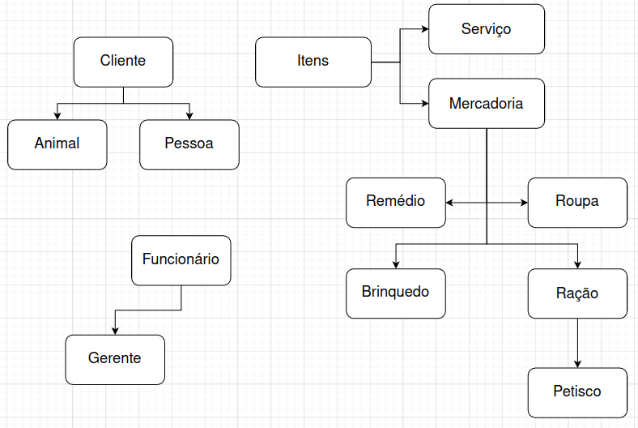

# Pet Shop - Gato Feliz

Trabalho em grupo da matéria de Orientação a Objeto.

Gestão do projeto: https://trello.com/b/2HzWGQDL/pet-shop-java

## Arquitetura:

  

O Desenvolvimento do projeto tem uma ordem baseada na arquitetura: Primeiro será feito o model, e depois o business (O repository não é necessário para que o business exista), posteriormente o controller e, enfim, o view.
A dependência de cada classe específica está detalhada no trello.

Abaixo, está detalhado as responsabilidades de cada pacote.

##### Repository:
As classes Repository são as responsáveis por trazer os dados à aplicação, seja de arquivos, banco de dados ou API's, e persisti-los, em caso de mudança.

##### Models:
Os Models serão responsáveis por receber os dados recuperados pelos repositories e formar objetos, implementando seus métodos e propriedades específicas.

##### Business:
As classes desse pacote serão responsáveis por implementar as regras de negócio e contratos e fazer as manipulações necessárias. Elas também serão as responsáveis por receber os dados dos repositories e formar os models.

##### Controller: 
Os controllers serão responsáveis por fazer a interface entre as classes view e as classes business.

##### View:
Esse pacote é responsável por exibir informações de forma gráfica e interagir com o usuário.

## Organização das classes do model:

  

A imagem acima define a organização e a hieraraquia das classes a serem seguidas.
As classes de cima devem ser feitas antes das de baixo, já que há dependência entre elas.

As classes business serão responsáveis por tratar cada tipo de classe do model, com base em sua identificação.

## Orientações para o desenvolvimento:
Ao assumir uma tarefa, crie uma branch (à partir da master) para atuar exclusivamente nela; se for para outra tarefa, utilizar outra branch.

Para padronização, utilizaremos a seguinte regra para o nome das branches: "'pacote'/'classe'", exemplo: "repository/cliente".
Os pull-requests devem seguir um padrão semelhante: "'Pacote': 'Classe'".

Os commits devem ter os seguintes prefixos (conventional commits): 
 - "feat: " para novas implementações; 
 - "BREAKING: " para alterações muito importantes;
 - "fix: " para correções;
 - "refactor: " para refatorações;
 - "chore: " para tarefas genéricas não enquadrada nas superiores
