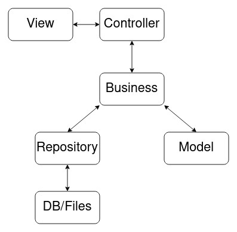

# Pet Shop - Gato Feliz

Trabalho em grupo da matéria de Orientação a Objeto.

Gestão do projeto: https://trello.com/b/2HzWGQDL/pet-shop-java

## Arquitetura:

  

O Desenvolvimento do projeto tem uma ordem baseada na arquitetura: Primeiro será feito o model, e depois o business (O repository não é necessário para que o business exista), posteriormente o controller e, enfim, o view.
A dependência de cada classe específica está detalhada no trello.

Abaixo, está detalhado as responsabilidades de cada pacote.

##### Repository:
As classes Repository são as responsáveis por trazer os dados à aplicação, seja de arquivos, banco de dados ou API's, e persisti-los, em caso de mudança.

##### Models:
Os Models serão responsáveis por receber os dados recuperados pelos repositories e formar objetos, implementando seus métodos e propriedades específicas.

##### Business:
As classes desse pacote serão responsáveis por implementar as regras de negócio e contratos e fazer as manipulações necessárias. Elas também serão as responsáveis por receber os dados dos repositories e formar os models.

##### Controller: 
Os controllers serão responsáveis por fazer a interface entre as classes view e as classes business.

##### View:
Esse pacote é responsável por exibir informações de forma gráfica e interagir com o usuário.

